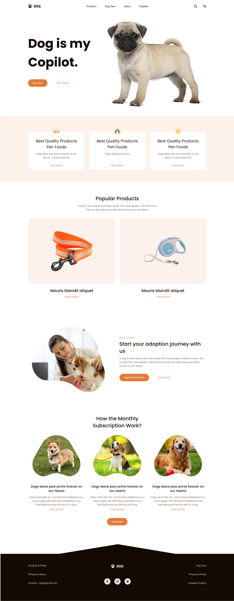

# HTML coding "Dog"

This is the html coding of a simple landing page.
[Link to Figma](https://www.figma.com/file/NorbYVUECb6Z42nTs7Ii3B/Dog-Layout?node-id=6468%3A41&t=aACBEORWD1zZIbUc-1).
The layout is drawn for desktop PC only.
Responsive layout made according to my imagination (360px - 1170px)
I use:

     - Desktop First
     - HTML
     - SCSS
     - FlexBox 
     - BEM

Layout preview:
